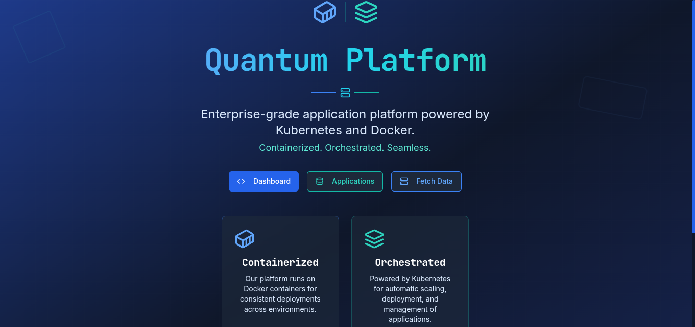

# Welcome to my full stack docker prodcution setup(Local)

Hey everyone, welcome to docker project!. The whole point of this project is to implement docker on a production scale for a fullstack application(Frontend + Backend + Database + Cache ) Everything from ports, to networks all the way down to the images is secured and implements best practices.

## NAVIGATING THE REPO
The project repo is pretty large(it will be by the time i'm done:)), to help you know what's where, and how to implement it, here's a breakdown. The project can be broken down into three broad catgories

- Frontend
- Backend
- Docker 

### FRONTEND
I'm a kubernetes engineer not a frontend engineer, so developing a frontend from scratch was out of the question. To solve this I used lovable AI(lovable.dev) to generate the frontend code which is in react and typescript. The frontend is designed to show that this project uses docker, with features such as buttons that communicate with the containerized backend(API) and get a response.

**The stack used for the frontend include:**

- Vite
- TypeScript
- React
- shadcn-ui
- Tailwind CSS

You can run the frontend code seperately without a docker container if you want to see it outside a container. For more information on the frontend setup, navigate to the `react-hello-world-start` folder. It has it's own dedicated readme.

## BACKEND
Lets talk about the backend. Again i'm a kubernetes engineer :), so my knowlege on backne services isn't the vastest but i'd say my skills in GO are pretty solid, hence the backend written purely in GO. The backend is broken into several folders/files:

**The stack used for the frontend include:**

- GO (tempted to troll python guys but nah:) )
  - Http framework : GIN
  - Database interaction: GORM
  - Redis interaction: go-redis

- `Databases` folder
 The setup uses a postgresql container as it's database(like why not?), and a redis conatiner for caching. The logic on how the backend(aka API container) interacts with these containers is housed here. I designed it so you can add other databases and caching technologies by simply creating a go file in the package

- `handlers` Folder
The handlers for the different routes are put in this folder, to make things organized and easier to track. RIght now the file names in this folder are pretty self-descriptive, so you should definitely follow something similar when putting your own handlers

- `middelware` Folder
All your middleware are kept in this folder

- `models` folder
This folder handles your custom datatypes(structs) for your code. For example for database interaction GORM is being used, and you may want to define the structs GORM would map to your database tables. This is done here

- `routes` folder
Your routes are here and point to their corresponding handler in the handlers package(folder)

- `templates` folder
Honestly i'm not sure what to do with this folder, if you see it in the repo, i guess i found something but otherwise , it's all you guys

and finally everything is called by the `main.go`

## DOCKER
The different layers/technologies used in this setup are contianerized, and configured to interact with one another. This can be summed up in three files

- `compose.yaml`
- `Dockerfile.frontend`
- `Dockerfile.prod`

## Compose.yaml
The different services/networks/volumes are configured here(i'm trolling :) ). But seriously, looking at the configurations each services is configured with a health check to confirm the container is running and not dead. You'll want to create a .env file for this and configure your variables. You don't have to worry about any of these being built into the images/containers, the `.env`, `.gitignore` and .`dockerignore` are taking care of these

If you take a closer look at the `Api` service, you can see the that the docker image for the backend is built here , so you dont have to worry about pulling it from a dockerhub. quay or whichever service you used, but in a prod environment (totally my opinion), it should definitely be pulled from one, with more dynamic tagging and versioning used.

## Dockerfile.frontend
This is used to build the react appplication image. In the file image uses a multi-satage build , with a lightweight nginx as the final image. It's also removed from root user, following the principle of least privilege (PoLP), which simply means the user created only accesses what it needs to run (so root directory access is out of the question). 

You could also implement the healthcheck for this in the image itself i suppose and remove it from the `compose.yaml`

## Dockerfile.prod
Poor naming convention here guys, definitely establish a naming convention before you start your projects. This actually builds the image for the backend(API) container. It uses a similar configuration to the react image in the sense PoLP is followed, a lightwieght image(alpine) is used as the final image. 

However, unlike the frontend image debugginf information specifically `DWARF` and `symbols table` is removed to reduce the size and prevent reverse enfineering using debugger/profile tools. This dropped the image by 6-8 mb if i'm not mistaken, you can easily compare this using `docker history` on the image to examine the image layers

